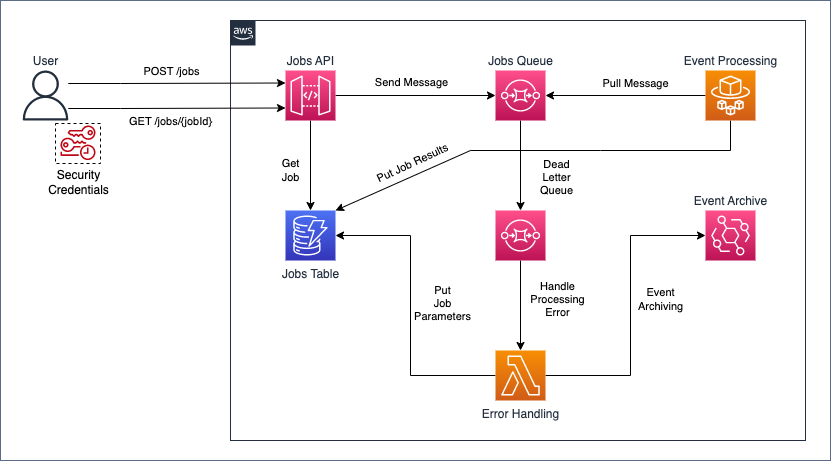

# Asynchronous Processing with API Gateway and SQS

Sample architecture to process events asynchronously using API Gateway and SQS.

## Architecture



A typical workflow looks as following:

1. The user authenticates against AWS Identity and Access Management (IAM) and obtains security credentials
2. The user does an HTTP POST request to the `/jobs` jobs API endpoint, specifying in the request body the job parameters
3. The jobs API Amazon API Gateway REST API returns to the user an HTTP response containing the job's identifier
4. The jobs API invokes sends a message to the SQS queue
5. The event processing AWS Fargate service pulls the messages from the SQS queue, processes the event, then puts the job results in the jobs Amazon DynamoDB table
6. The user does an HTTP GET request to the `/jobs/{jobId}` jobs API endpoint, with the job identifier from step 3. as `{jobId}`
7. The jobs API queries the jobs table to retrieve the job results
8. The jobs API returns to the user an HTTP response containing the job results

If the event processing fails:

1. The SQS queue sends the event to the dead-letter queue (DLQ)
2. An EventBridge event triggers the error handling function
3. The error handling function puts the job parameters in the jobs Amazon DynamoDB table
4. The user can retrieve the job parameters by doing an HTTP GET request to the /jobs/{jobId} jobs API endpoint

If the error handling fails:

1. The error handling function sends the event to an Amazon EventBridge archive
2. The user can replay the archived events by using the related Amazon EventBridge feature

### Best Practices

- This sample architecture doesn't include monitoring of the deployed infrastructure. If your use case requires monitoring, evaluate to add it (for example, using [CDK Monitoring Constructs](https://constructs.dev/packages/cdk-monitoring-constructs))
- This sample architecture uses [IAM Permissions](https://docs.aws.amazon.com/apigateway/latest/developerguide/permissions.html) to control the access to the jobs API. Anyone authorized to assume the `JobsAPIInvokeRole` will be able to invoke the jobs API: as such, the access control mechanism is binary. If your use case requires a more complex authorization model, evaluate to [use a different access control mechanism](https://docs.aws.amazon.com/apigateway/latest/developerguide/apigateway-control-access-to-api.html)
- When a user does an HTTP POST request to the `/jobs` jobs API endpoint, the input data is validated at two different levels: Amazon API Gateway is in charge of the first [request validation](https://docs.aws.amazon.com/apigateway/latest/developerguide/api-gateway-method-request-validation.html) while while the task launched by the AWS Fargate service executes the second one. No validation is performed when the user does an HTTP GET request to the `/jobs/{jobId}` jobs API endpoint. If your use case requires additional input validation and an increased level of security, evaluate to [use AWS WAF to protect your API](https://docs.aws.amazon.com/apigateway/latest/developerguide/apigateway-control-access-aws-waf.html)

## Prerequisites

Install on your workstation the following tools:

- [AWS Cloud Development Kit (CDK) Toolkit](https://docs.aws.amazon.com/cdk/v2/guide/cli.html) version `2.61.0`
- [Docker](https://docs.docker.com/get-docker/) version `20.10.21`
- [Node.js](https://nodejs.org/en/download/) version `18.13.0`
- [Projen](https://pypi.org/project/projen/) version `0.67.3`
- [Python](https://www.python.org/downloads/) version `3.9.16`

You should also own or have access to an [AWS account](https://docs.aws.amazon.com/accounts/latest/reference/manage-acct-creating.html).

## Setup

Execute the following steps on your workstation:

- Clone this repository
- Change directory to the repository root:

```bash
cd asynchronous-event-processing-api-gateway-api-gateway-sqs-cdk
```

- Setup the project using [Projen](https://github.com/projen/projen):

```bash
npx projen
```

- Activate the [Python virtual environment](https://docs.python.org/3/library/venv.html):

```bash
source .env/bin/activate
```

- Install the [pre-commit](https://pre-commit.com/) hooks:

```bash
pre-commit install
pre-commit install --hook-type commit-msg
```

## Test

To run the project tests execute:

```bash
npx projen test
```

## Lint

To lint the project code execute:

```bash
npx projen synth
npx projen lint
```

## Scan

To perform a security scan of the project code execute:

```bash
npx projen synth
npx projen scan
```

## Release

Execute the following steps on your workstation:

- Change the value of `__version__` in `.projenrc.py` (follow [PEP440](https://peps.python.org/pep-0440/) specification):

```python
...
__version__ = "0.1.0"
...
```

- Update [Projen](https://github.com/projen/projen) task definitions:

```bash
npx projen
```

- Release a new version using [Projen](https://github.com/projen/projen):

```bash
npx projen release
```

- Push to remote, including tags:

```bash
git push
git push --tags
```

## Bootstrap

To bootstrap the [AWS CDK](https://aws.amazon.com/cdk/) in your AWS account execute:

```bash
AWS_PROFILE=$YOUR_AWS_PROFILE npx projen bootstrap
```

## Deployment

To deploy your application in your AWS account execute:

```bash
AWS_PROFILE=$YOUR_AWS_PROFILE npx projen deploy
```

## Cleanup

To cleanup your application in your AWS account execute:

```bash
AWS_PROFILE=$YOUR_AWS_PROFILE npx projen destroy
```

## Try it out

To try the sample architecture included in this repository proceed to:

- Perform a [deployment](#deployment) in your AWS account
- Install on your workstation the [AWS Command Line Interface (CLI)](https://docs.aws.amazon.com/cli/latest/userguide/getting-started-install.html)
- [Assume](https://awscli.amazonaws.com/v2/documentation/api/latest/reference/sts/assume-role.html) the `JobsAPIInvokeRole` printed as output from the deploy command
- Install [Postman](https://www.postman.com/downloads/) on your workstation
- [Import](https://learning.postman.com/docs/getting-started/importing-and-exporting-data/) the [Postman collection](./postman_collection.json) included in this repository
- [Set](https://learning.postman.com/docs/sending-requests/variables/) the `JobsAPI` variables as following:
  - `accessKey`: value of the `Credentials.AccessKeyId` attribute from the `assume-role` command
  - `baseUrl`: value of the `JobsApiJobsAPIEndpoint` output from the deploy command **without trailing slash**
  - `region`: value of the [AWS Region](https://docs.aws.amazon.com/AWSEC2/latest/UserGuide/using-regions-availability-zones.html#concepts-regions) where you deployed the sample architecture
  - `seconds`: the value of the input parameter for the sample job. It must be a positive integer
  - `secretKey`: value of the `Credentials.SecretAccessKey` attribute from the `assume-role` command
  - `sessionToken`: value of the `Credentials.SessionToken` attribute from the `assume-role` command
- Test the sample architecture by [sending requests](https://learning.postman.com/docs/sending-requests/requests/#next-steps) to the jobs API

## Security

See [CONTRIBUTING](CONTRIBUTING.md#security-issue-notifications) for more information.

## License

This library is licensed under the MIT-0 License. See the LICENSE file.
